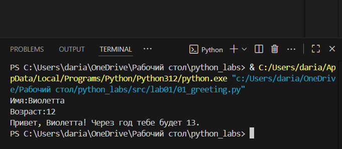
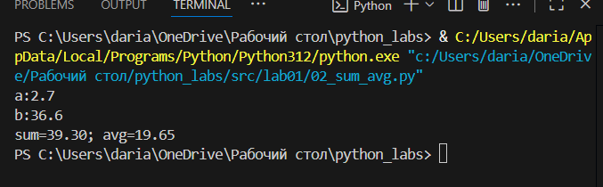
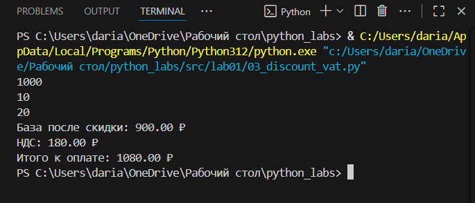
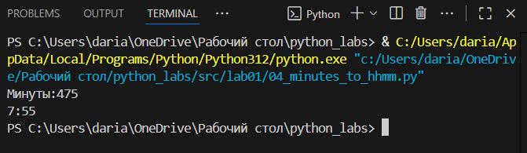
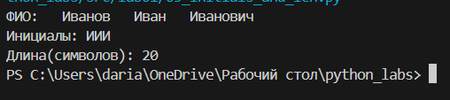

## Лабораторная работа 1
### 1 номер

```
name=input('Имя:')
age=int(input('Возраст:'))
print(f'Привет, {name}! Через год тебе будет {age+1}.')
```


### 2 номер

```
a=float(input('a:'))
b=float(input('b:'))
sum=a+b
avg=(a+b)/2
print(f'sum={sum:.2f}; avg={avg:.2f}')
```


### 3 номер

```
price=float(input())
discount=float(input())
vat=float(input())
base=price*(1-discount/100)
vat_amount=base*(vat/100)
total=base+vat_amount
print(f'База после скидки: {base:.2f} ₽')
print(f'НДС: {vat_amount:.2f} ₽')
print(f'Итого к оплате: {total:.2f} ₽')
```


### 4 номер

```
m=int(input('Минуты:'))
hours=m//60
minutes=m-(60*hours)
print(f'{hours}:{minutes:02d}')
```


### 5 номер 

```
name=input('ФИО:')
name=name.split()

initsial=[name[i][0] for i in range(len(name))]

initsial=''.join(initsial)

name=''.join(name)
long=len(name)+2


print(f'Инициалы: {initsial}')
print(f'Длина(символов): {long}')
```


## Лабораторная работа 2

### Задание 1
### 1

```
def min_max(nums: list[float | int]) -> tuple[float | int, float | int]:
    if len(nums)==0:
        return ValueError

    maxi=-10**10
    mini=10**10

    for i in range(len(nums)):
        if nums[i] > maxi:
            maxi = nums[i]
        if nums[i] < mini:
            mini = nums[i]

    return (mini, maxi)
nums=[-5, -2, -9]
print(min_max(nums))
```
.png)

### 2

```
def unique_sorted(nums: list[float | int]) -> list[float | int]:
    return sorted(set(nums))
print(unique_sorted([1.0, 1, 2.5, 2.5, 0]))
```
.png)

### 3

```
def flatten(mat: list[list | tuple]) -> list:
    itog=[]
    for element in mat:
        if isinstance(element,(list,tuple)):
            for member in element:
                itog.append(member)
        else:
            return TypeError
    return itog
print(flatten(([1, 2], (3, 4, 5))))
```
.png)


### Задание В
### 2

```
def row_sums(mat: list[list[float | int]]) -> list[list]:
    
    if len(mat)>0:
        for i in range(len(mat)-1):
            if len(mat[i])!=len(mat[i+1]): return ValueError
    symma=[]
    for stroka in mat:
        symma.append(sum(stroka))
    return symma

print(row_sums([[-1,1],[10,-10]]))
```
.png)

### 3

```
def col_sums(mat: list[list[float | int]]) -> list[list]:
    if len(mat)>0:
        for i in range(len(mat)-1):
            if len(mat[i])!=len(mat[i+1]): return ValueError

    syms = list(0 for x in range(len(mat[0])))

    for i in range(len(mat)):
        for j in range(len(mat[i])):
            syms[j]+=mat[i][j]

    return syms
print(col_sums([[1, 2, 3], [4, 5, 6]]))
```
.png)