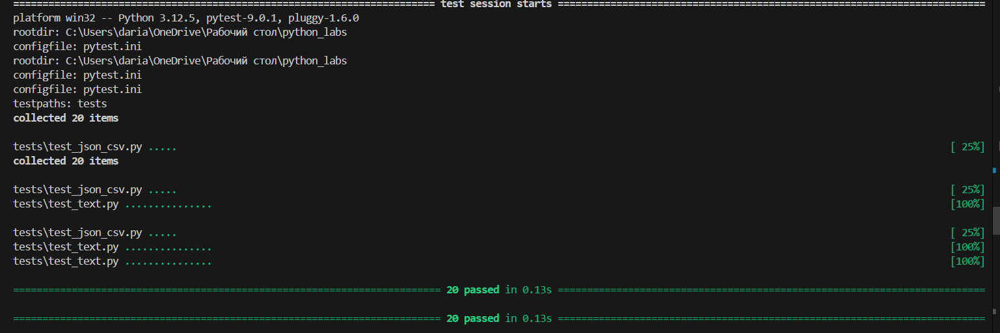
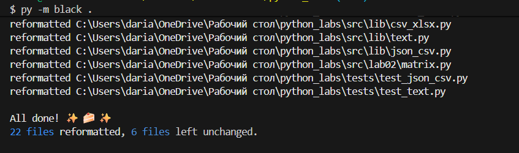

## Лабораторная работа №7
### Задание A
```py
import pytest #подключение инструментов для тестирования функций

from src.lib.text import count_freq, normalize, tokenize, top_n

#параматризация теста (что подается, что должно получиться), далее - сам тест
@pytest.mark.parametrize(
    "src,expected",
    [
        ("ПрИвЕт\nМИр\t", "привет мир"),
        ("ёжик, Ёлка", "ежик, елка"),
        ("Hello\r\nWorld", "hello world"),
        ("  двойные   пробелы  ", "двойные пробелы"),
    ],
)
def test_normalize(src, expected):
    assert normalize(src) == expected

@pytest.mark.parametrize(
    "src,expected",
    [
        ("привет мир", ["привет", "мир"]),
        ("hello,world!!!", ["hello", "world"]),
        ("по-настоящему круто", ["по-настоящему", "круто"]),
        ("2025 год", ["2025", "год"]),
        ("emoji 😀 не слово", ["emoji", "не", "слово"]),
    ],
)
def test_tokenize(src, expected):
    assert tokenize(src) == expected


@pytest.mark.parametrize(
        "tokens, expected",
        [
            (["a", "b", "a", "c", "b", "a"], {"a": 3, "b": 2, "c": 1}), 
            (["good","good","good"], {"good":3}), #проверка, когда одно значение
            (["💕","💕","💕","🤷‍♀️"],{"💕":3,"🤷‍♀️":1}), #проверка эмодзи
        ],
)
def test_count_freq(tokens, expected):
    assert count_freq(tokens) == expected

@pytest.mark.parametrize(
        "words, n, expected",
        [
        ({"c":6, "a":6, "b":2}, 2, [("a", 6), ("c", 6)]), #когда одинаковое кол-во -> по алфавиту
        ({"a": 3, "b": 2}, 5, [("a", 3), ("b", 2)]), #n больше чем всего значений
        ],
)

def test_top_n(words, n, expected):
    assert top_n(words, n) == expected

#проверка на пустоту
def test_empty():
    assert normalize("") == ""
    assert tokenize("") == []
    assert count_freq([]) == {}
    assert top_n({}, 5) == []
``` 

### Задание B
```py
import json, csv
from pathlib import Path
import pytest
from lab05.json_csv import json_to_csv
from lab05.csv_json import csv_to_json

##вспомогательные функции
#запись объекта в json файл
def write_json(path: Path, obj):
    path.write_text(json.dumps(obj, ensure_ascii=False, indent=2), encoding="utf-8")

#читает csv и возвращает список словарей, где ключи - названия колонок
def read_csv_rows(path: Path):
    with path.open(encoding="utf-8") as f:
        return list(csv.DictReader(f))

def test_json_to_csv_roundtrip(tmp_path: Path):
    src = tmp_path / "people.json" #создаём временный файл
    dst = tmp_path / "people.csv"
    data = [{"name": "Alice", "age": 22}, {"name": "Bob", "age": 25}]
    write_json(src, data) #записываем тестовые данные

    json_to_csv(str(src), str(dst)) #тестируем функцию
    rows = read_csv_rows(dst) чтение рез-та
    assert len(rows) == 2
    assert set(rows[0]) >= {"name", "age"} #проверка, что как минимум эти два заголовка имеются


def test_csv_to_json_roundtrip(tmp_path: Path):
    src = tmp_path / "people.csv" #создаем временный csv; записываем данные
    dst = tmp_path / "people.json"
    src.write_text("name,age\nAlice,22\nBob,25\n", encoding="utf-8")#записываем в цсв данные

    csv_to_json(str(src), str(dst)) #тестируем ф-цию
    obj = json.loads(dst.read_text(encoding="utf-8")) #читаем json (из строки в объект)
    assert isinstance(obj, list) and len(obj) == 2
    assert set(obj[0]) == {"name", "age"}

#тест пустого json
def test_json_to_csv_empty_raises(tmp_path: Path):
    src = tmp_path / "empty.json"
    src.write_text("[]", encoding="utf-8") #создаем пустой массив
    with pytest.raises(ValueError): #внутри блока должна произойти ошибка
        json_to_csv(str(src), str(tmp_path / "out.csv"))

#тест csv без заголовка
def test_csv_to_json_no_header_raises(tmp_path: Path):
    src = tmp_path / "bad.csv"
    src.write_text("", encoding="utf-8") #пишем пустой файл
    with pytest.raises(ValueError): #внутри блока должна произойти ошибка
        csv_to_json(str(src), str(tmp_path / "out.json"))

#тест не существующего файла
def test_missing_file_raises():
    with pytest.raises(FileNotFoundError): #внутри блока должна произойти ошибка
        csv_to_json("nope.csv", "out.json")
```
## результат работы 
### pytest:


### black :
