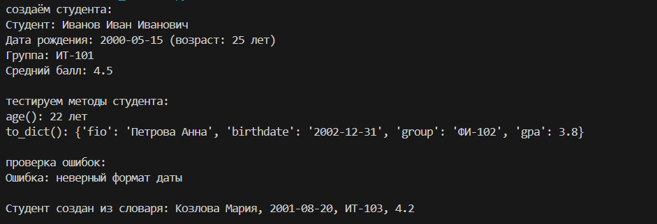
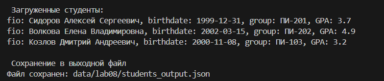
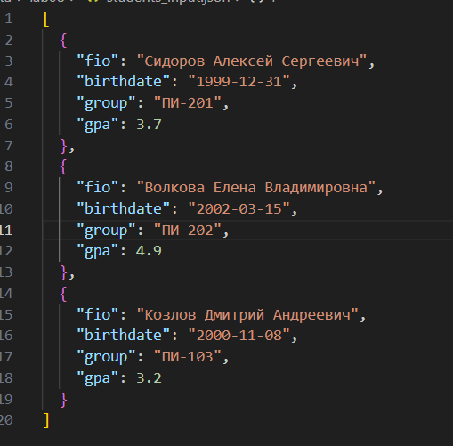
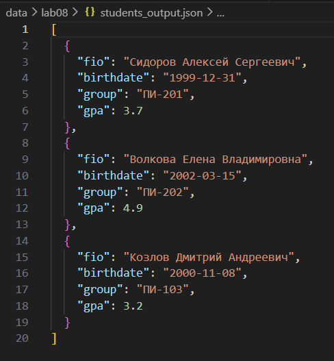

## Лабораторная 8

### A. Реализация класса Student
```py
from dataclasses import dataclass, asdict 
from datetime import date
from typing import ClassVar
import re

@dataclass #автоматически создаёт методы
class Student:
    #создаём переменную для всего класса
    correct_data: ClassVar[str] = r'^(19|20)[0-9]{2}-(1[0-2]|0[1-9])-(0[1-9]|[12][0-9]{1}|3[01])$'
    #знак в начале паттерна и в конце показывает, что дата должна совпадать от начала до конца (ничего лишнего)
    fio: str
    birthdate: str
    group: str
    gpa: float

    #валидация:
    def __post_init__(self):
        self._validate_birthdate()
        self._validate_gpa()

    def _validate_birthdate(self):
        if not re.match (self.correct_data, self.birthdate):
            raise ValueError("неверный формат даты")
        
    def _validate_gpa(self):
        if not (0 <= self.gpa <= 5):
            raise ValueError("GPA должен быть от 0 до 5")
    
    def count_age(self):
        "вычисляем возраст студента на текущую дату"
        year, month, day = map(int, self.birthdate.split('-')) #достаем из даты год, месяц, денб
        birth_date=date(year, month, day) #создаем объект date
        today=date.today() #сегодняшняя дата
        age = today.year - birth_date.year

        #дата дня рождения в этом году:
        birthday_this_year = date(today.year, birth_date.month, birth_date.day)
        #если др не было в этом году, то вычитаем 1:
        if today < birthday_this_year:
            age -= 1
        return age
    
    def to_dict(self):
        "преобразуем объект Student в словарь"
        return asdict(self)
    
    @classmethod #создает метод класса, который работает с классом в целом, а не с объектом
    def from_dict(cls, data: dict):
        "создаём объект Student из словаря"

        fio=data['fio']
        birthdate=data['birthdate']
        group=data['group']
        gpa=data['gpa']

        return cls(fio,birthdate,group,gpa)
    
    def __str__(self):
        "строковое представление студента"
        fio=self.fio 
        birthdate=self.birthdate
        age=self.count_age()
        group=self.group
        gpa=self.gpa
        return (
            f"Студент: {fio}\n"
            f"Дата рождения: {birthdate} (возраст: {age} лет)\n"
            f"Группа: {group}\n"
            f"Средний балл: {gpa}"
        )
```


### B. Реализация сериализации
```py
import json
from typing import List
from models import Student

def students_to_json(students: list[Student], path):
    """
    Сериализует список объектов Student в JSON файл
    
    Подаем:
        students: список объектов Student
        path: путь к файлу для сохранения
    """
    #используем метод to_dict() для каждого студента
    students_data = [student.to_dict() for student in students]

    with open(path, 'w', encoding='utf-8') as f:
        json.dump(students_data, f, ensure_ascii=False, indent=2)


def students_from_json(path: str) -> List[Student]:
    """
    Создает список объектов Student из JSON файла
    
    Подаем:
        path: путь к JSON файлу
        
    Возвращаем:
        List[Student]: список объектов Student
    """
    try:
        with open(path, 'r', encoding='utf-8') as f:
            students_data = json.load(f)
        
        # Используем метод класса from_dict() для создания объектов
        students = [Student.from_dict(data) for data in students_data]
        return students
    except FileNotFoundError:
        print(f"Файл {path} не найден")
        return []
```


, 