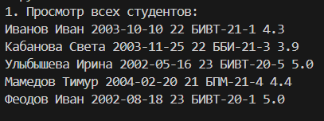
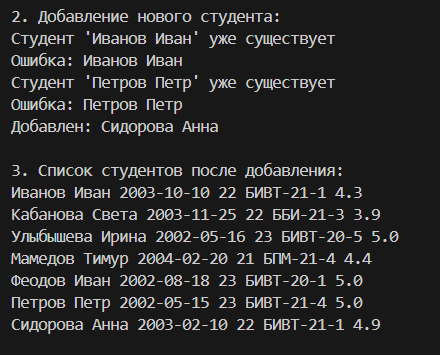
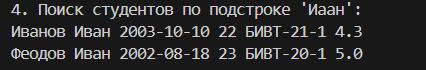
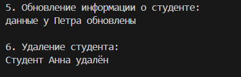
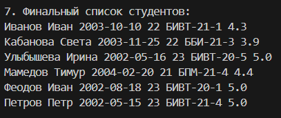

## Лабораторная работа №9

```py
from src.lab08.models import Student
from pathlib import Path
import os
import csv

class Group:
    def __init__(self, csv_path: str):
        """ инициализацтя хранилища студентов
        подаём: сsv_path - путь к csv-файлу"""

        self.csv_path = str(Path(csv_path))
        self._ensure_file_exists() #проверяем/создаем файл

#ВСПОМОГАТЕЛЬНЫЕ МЕТОДЫ (ПРИВАТНЫЕ)
    def _ensure_file_exists(self):
        """создаем папку, если ее нет, создаем CSV-файл с заголовками, если его нет"""
        #проверка существования файла/папки по указ. пути (если есть, ничего не делаем)

        if os.path.exists(self.csv_path):
            return
        
        folder = os.path.dirname(self.csv_path) 
        #извлекает путь к папке из полного пути к файлу
        
        if folder: #проверяем есть ли папка в пути
            os.makedirs(folder, exist_ok=True)

        #создание файла с заголовками
        with open(self.csv_path, 'w', encoding='utf-8') as f:
            f.write("fio,birthdate,group,gpa\n")
    
    def _read_all(self):
        """читаем всех студентов из файла"""
        students = []
        try:
            with open(self.csv_path, 'r', encoding='utf-8') as f:
                reader = csv.DictReader(f)
                for row in reader:
                    gpa = row.get('gpa', '0') #надо изменить строковую запись оценки
                    gpa = float(gpa)
                    
                    try:
                        student = Student(
                            fio=row.get('fio', '').strip(),
                            birthdate=row.get('birthdate', '').strip(),
                            group=row.get('group', '').strip(),
                            gpa=gpa
                        )
                        students.append(student)
                    except ValueError as e:
                        print(f"Ошибка создания студента: {e}")
                        continue
                        
        except FileNotFoundError:
            pass
        
        return students
    
    def _save_students(self, students):
        """Сохраняет список студентов в файл"""
        with open(self.csv_path, 'w', encoding='utf-8', newline='') as f:
            writer = csv.DictWriter(f, fieldnames=['fio', 'birthdate', 'group', 'gpa'])
            writer.writeheader()
            
            for student in students:
                writer.writerow({
                    'fio': student.fio,
                    'birthdate': student.birthdate,
                    'group': student.group,
                    'gpa': str(student.gpa)
                })
    
    

#ОСНОВНЫЕ МЕТОДЫ (CRUD)

    def list(self):
        """возвращает всех студентов в виде списка"""
        return self._read_all()

    def add(self, student: Student):
        """добавляем нового студента"""

        #1. читаем всех студентов
        all_students = self._read_all() 

        #2. проверяем, есть ли уже такой студент
        for s in all_students:
            if s.fio.lower() == student.fio.lower():
                print(f"Студент '{student.fio}' уже существует")
                return False
        #3. добавляем нового студента
        all_students.append(student)
        
        #4. сохраняем новый список
        self._save_students(all_students)
        return True
    
    def find(self, need_fio: str):
        """находит студента по подстроке fio"""
        all_students = self._read_all()
        found = []

        need_fio = need_fio.lower()

        for student in all_students:
            if need_fio in student.fio.lower():
                found.append(student)

        return found
    
    def remove(self, extra_fio: str):
        """удаляет запись с данным fio"""
        all_students = self._read_all()

        new_list = []

        extra_fio = extra_fio.lower()

        for student in all_students:
            if student.fio.lower() != extra_fio:
                new_list.append(student)
        
        #если список уменьшился, значит кого-то удалии, метод сработал
        if len(new_list) < len(all_students):
            self._save_students(new_list)
            return True
        else:
            print(f"Студент '{extra_fio}' не найден")
            return False
        
    def update(self, fio: str, **changes):
        """обновляет поля существующего студента
        **changes - можно передавать любое количество полей для обновления
        ** превращает переданные параметры в словарь
        """

        all_students = self._read_all()
        updated = False

        for student in all_students:
            if student.fio.lower() == fio.lower():
                if 'group' in changes:
                    student.group = changes['group']
                if 'gpa' in changes:
                    student.gpa = changes['gpa']
                if 'birthdate' in changes:
                    student.birthdate = changes['birthdate']
                updated = True
                break

        if updated:
            self._save_students(all_students)
        
        return updated
```
_read_all:


add:
 

find:


update, remove:


ИТОГ:

