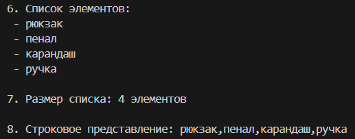

## Лабораторная работа 10
## Теоретическая часть
### Стек (Stack)
Стек — это структура данных, работающая по принципу "последним пришёл — первым вышел" (LIFO, Last In First Out). Представляет собой список элементов, организованных по принципу LIFO.

### Основные операции:

push(item) — добавить элемент на вершину стека — O(1)
pop() — извлечь верхний элемент — O(1)
peek() — посмотреть верхний элемент без извлечения — O(1)
is_empty() — проверить, пуст ли стек — O(1)

### Применение:
Обратная польская нотация
Рекурсивные вызовы функций
Отмена операций (undo)

### Очередь (Queue)
Очередь — это структура данных, работающая по принципу "первым пришёл — первым вышел" (FIFO, First In First Out). Представляет собой список элементов, организованных по принципу FIFO.

### Основные операции:

enqueue(item) — добавить элемент в конец очереди — O(1)
dequeue() — извлечь первый элемент — O(1)
peek() — посмотреть первый элемент без извлечения — O(1)
is_empty() — проверить, пуста ли очередь — O(1)

### Применение:
Планирование задач
Обработка запросов
Алгоритмы обхода графов

### Связный список (Linked List)
Связный список — это структура данных, состоящая из узлов, каждый из которых содержит данные и ссылку (указатель) на следующий узел в последовательности.

### Односвязный список (Singly Linked List):

Каждый узел содержит данные и указатель на следующий узел
Первый узел называется "головой" (head)
Последний узел указывает на None

### Основные операции:
append(value) — добавить элемент в конец — O(1) (при наличии tail)
prepend(value) — добавить элемент в начало — O(1)
insert(idx, value) — вставить элемент по индексу — O(n)
remove(value) — удалить элемент по значению — O(n)
remove_at(idx) — удалить элемент по индексу — O(n)

### Преимущества:
Динамический размер
Эффективная вставка и удаление в начале — O(1)

### Недостатки:
Доступ к элементу по индексу — O(n)
Дополнительная память на хранение указателей

## Реализация
### Stack и Queue
```py
from collections import deque
from typing import Any

class Stack:
    """Структура данных "Стек" (LIFO - Last In, First Out)
    Реализация на базе списка (list)"""
    def __init__(self):
        """создание и настройка (инициализация) пустого стека"""
        self._data: list[Any] = []
        
    def push(self, item: Any):
        """Добавить элемент на вершину стека (ничего не возвращает)
        подаем: item: элемент для добавления"""
        self._data.append(item)

    def is_empty(self):
        """Проверить, пуст ли стек
        возвратить: True если стек пуст, иначе False"""
        return len(self._data)==0

    def pop(self):
        """Cнять верхний элемент стека и вернуть его
        oшибка, если стек пуст"""
        if self.is_empty():
            raise IndexError("Невозможно извлечь элемент: стек пуст")
        return self._data.pop()
    
    def peek(self):
        """Посмотреть верхний элемент без удаления
        возвратить: верхний элемент стека или None, если стек пуст"""
        if self.is_empty():
            return None
        return self._data[-1]
    
    def __len__(self):
        """Возвращает количество элементов в стеке"""
        return len(self._data)
    
    def __str__(self):
        """Строковое представление стека, возвращает строку"""
        return f"Stack({self._data})"
    
    def __repr__(self) -> str:
        """Техническое представление для отладки"""
        return f"Stack({self._data})"
    

class Queue:
    """Структура данных "Очередь" (FIFO - First In, First Out)
    Реализация на базе collections.deque"""

    def __init__(self):
        """Инициализация пустой очереди"""
        self._data: deque[Any] = deque()

    def enqueue(self, item: Any):
        """Добавить элемент в конец очереди
        подаем: item (элемент для добавления)"""
        self._data.append(item)

    def is_empty(self):
        """Проверить, пуста ли очередь
        возвращает: True если очередь пуста, иначе False"""
        return len(self._data) == 0

    def dequeue(self):
        """Взять элемент из начала очереди и вернуть его
        возвращаем: первый жлемент очереди
        ошибка: если пустая очередь"""
        if self.is_empty():
            raise IndexError("Невозможно извлечь элемент: очередь пуста")
        return self._data.popleft()

    def peek(self):
        """Посмотреть первый элемент без удаления
        возвращает: первый элемент в очереди или None, если очередь пуста"""
        if self.is_empty():
            return None
        return self._data[0]

    def __len__(self):
        """Количество элементов в очереди"""
        return len(self._data)

    def __str__(self) -> str:
        """Строковое представление очереди, возвращает строку"""
        return f"Queue({list(self._data)})"
    
    def __repr__(self) -> str:
        """Представление для отладки"""
        return f"Queue({list(self._data)})"
```
### пример стека:

### пример очереди:


### SinglyLinkedList
```py
from typing import Any

class Node:
    """Узел односвязного списка.
    Содержит значение и ссылку на следующий узел."""

    def __init__(self, value: Any):
        """Инициализация узла.
        value: значение, которое хранит узел"""
        self.value = value
        self.next: 'Node' | None = None #следующий объект либо объект класса, либо ничего

    def __str__(self) -> str:
        """Строковое представление узла"""
        return f"Node({self.value})"
    
class SinglyLinkedList:
    """Односвязный список.
    Состоит из узлов Node, связанных через next."""

    def __init__(self):
        """Инициалищация пустого списка"""
        self.head: Node | None = None #первый узел
        self.tail: Node | None = None #последний узел
        self._size = 0 #количество элементов
    
    def is_empty(self):
        """Проверяет, пуст ли список"""
        return self.head is None
    
    def append(self, value: Any):
        """Добавляет элемент в КОНЕЦ списка.
        Время: O(1) благодаря tail.
        value: значение для добавления
        ничего не возвращает"""
        new_node = Node(value)

        if self.is_empty():
            # Если список пуст, новый узел становится и head и tail
            self.head = new_node
            self.tail = new_node
        else:
            # Добавляем после tail и обновляем tail
            self.tail.next = new_node
            self.tail = new_node
        self._size +=1

    def prepend(self, value: Any):
        """ Добавляет элемент в начало списка.
        Время: O(1).
        value: значение для добавления
        ничего не возвращает"""
        new_node = Node(value)
        if self.is_empty():
            # Если список пуст, новый узел становится и head и tail
            self.head = new_node
            self.tail = new_node
        else:
            # Новый узел становится головой
            new_node.next = self.head
            self.head = new_node
        
        self._size += 1
    
    def insert(self, idx: int, value: Any):
        """Вставляет элемент по указанному индексу.
        подаём:
        idx: индекс для вставки (0 = начало, len(list) = конец)
        value: значение для вставки
        ошибка: если индекс вне диапазона [0, len(list)]"""
        
        # Проверка индекса
        if idx < 0 or idx > self._size:
            raise IndentationError(f"Индекс {idx} вне диапазона [0, {self._size}]")
        # Специальные случаи
        if idx == 0:
            self.prepend(value)
            return
        elif idx == self._size:
            self.append(value)
            return
        # Обычный случай (вставка в середину)
        new_node = Node(value)

        # Находим узел ПЕРЕД местом вставки
        pered = self.head
        for i in range(idx-1):
            pered = pered.next

        # Вставляем новый узел между pered и pered.next
        new_node.next = pered.next
        pered.next = new_node
        
        self._size += 1

    def remove(self, value: Any):
        """Удаляет ПЕРВОЕ вхождение значения из списка.
        value: значение для удаления
        возвращает: True если элемент был найден и удалён, False если не найден"""
        if self.is_empty():
            return False
        
        # Специальный случай: удаляем голову
        if self.head.value == value:
            self.head = self.head.next
            # Если список стал пустым, обнуляем tail
            if self.head is None:
                self.tail = None
            self._size -= 1
            return True
        
        # Ищем узел ПЕРЕД тем, который нужно удалить
        pered = self.head
        while pered.next is not None and pered.next.value != value:
            pered = pered.next
        
        # Если не нашли значение
        if pered.next is None:
            return False
        
        # Удаляем узел
        pered.next = pered.next.next
        
        # Если удалили последний элемент, обновляем tail
        if pered.next is None:
            self.tail = pered
        
        self._size -= 1
        return True
        
    def __iter__(self):
        """Возвращает итератор по значениям в списке."""
        pered = self.head
        while pered is not None:
            #Функция с yield генерирует по одному
            yield pered.value
            pered = pered.next
        
    def __len__(self):
        """Возвращает количество элементов в списке"""
        return self._size
    
    def __repr__(self) -> str:
        """Возвращает строковое представление."""
        values = list(self)
        return f"SinglyLinkedList({values})"
    
    def __str__(self) -> str:
        """Строковое представление для пользователя"""
        values = []
        current = self.head
        while current is not None:
            values.append(str(current.value))
            current = current.next
        return ",".join(values)
```
### пример
  